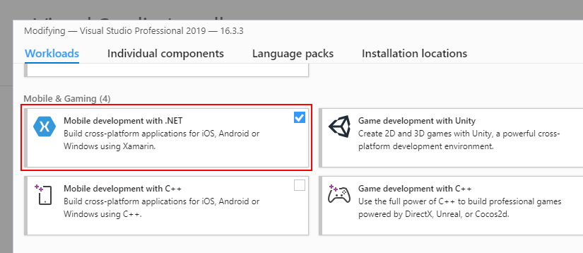
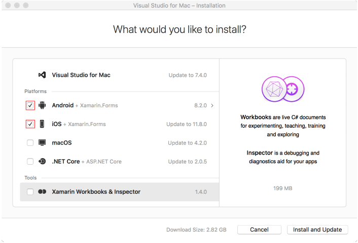

# Requisitos para Xamarin

## Windows

- Mínimo 2 GB de RAM
- Windows 7 o superior (se recomienda Windows 8-10)
- Visual Studio 2012 Community o superior
- Xamarin para Visual Studio

[Descargar](https://visualstudio.microsoft.com/downloads/)

Para instalar Xamarin para Visual Studio 2019/Visual Studio 2017, deberá habilitar la opción **Desarrollo móvil con .Net**

- Si ejecuta una instalación nueva de Visual Studio, se le pedirá que seleccionar **Desarrollo móvil con .Net** durante el proceso de instalación.

- Si ya tiene instalado Visual Studio, puede modificar la opción **Desarrollo móvil con .Net** volviendo a ejecutar el instalador de Visual Studio y seleccionando la opción "Modificar".

## Mac
- Mac con OS X Yosemite (10.10) o superior
- IDE Xcode de Apple (7+) y SDK de iOS
- Visual Studio para Mac con Xamarin instalado.

[Descargar](https://www.visualstudio.com/downloads)

El instalador de Visual Studio para Mac inspecciona su sistema y verifica qué componentes están instalados y cuáles deben actualizarse. 

Para asegurarse de que Xamarin esté instalado, deberá ejecutar el instalador de VS para Mac y verificar si las opciones de **Android** e **iOS** están habilitadas.

 
